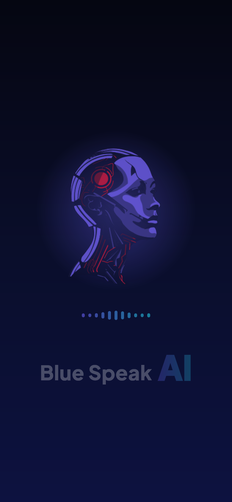
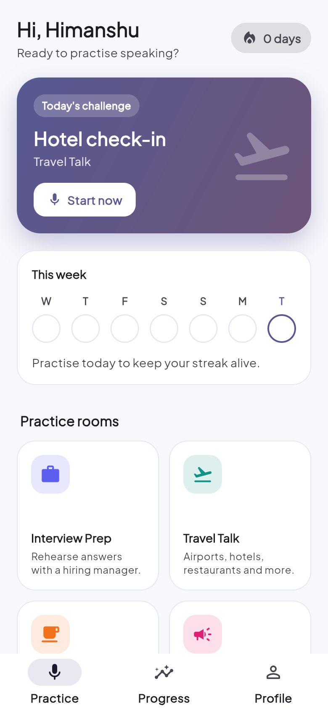
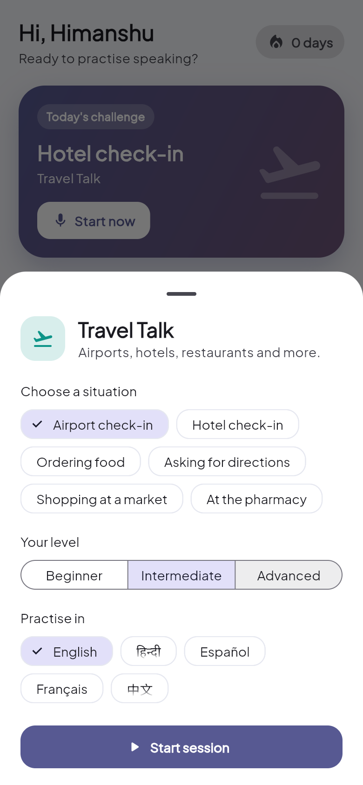
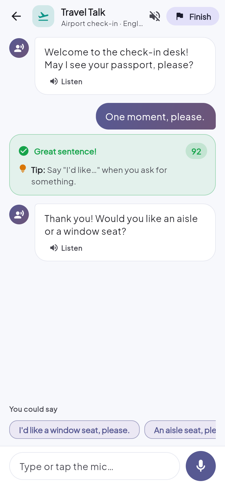
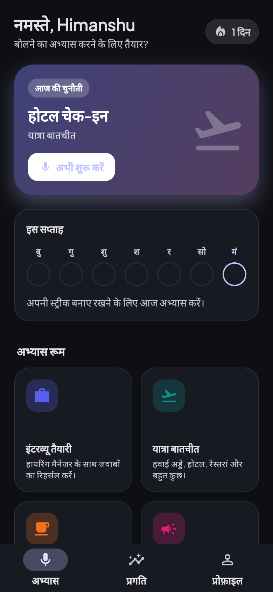

<div align="center">


# BlueSpeak AI

**An AI speaking coach. Talk out loud, get corrected instantly, and build a streak.**

[**Live demo**](https://himanshu-moderator.github.io/bluespeak-ai/) · [**Project report (PDF)**](docs/BlueSpeak-AI-Project-Report.pdf) · [How it works](#how-it-works) · [Run it locally](#run-it-locally)


</div>

<p align="center">
  
  
  
  
  
</p>

## Why this exists

Most people learn a language by reading, not speaking, and what actually holds them back is that
**nobody is there to talk to without judging them**. BlueSpeak is a patient conversation partner
that is available at 2 a.m., never gets tired, and tells you exactly what to fix after every sentence.

It is not a generic chatbot. Every conversation has a purpose, a role for the AI, and a score.

## What you can do

| Room | What the AI plays | Use it to |
|---|---|---|
| **Interview Prep** | A hiring manager | Rehearse real answers out loud |
| **Travel Talk** | Airport staff, hotel, waiter, shopkeeper... | Get through trips without freezing |
| **Daily Chat** | A friendly local | Sound natural in small talk |
| **Pitch & Present** | An audience / investor | Practise a 30-second pitch |
| **Describe a Picture** | A tutor | Upload a photo and describe it |
| **Free Talk** | A conversation partner | Chat about anything |

After **every message** you get a corrected sentence, a short explanation, a tip and a 0 to 100 score.
When you finish, you get a session summary with strengths, things to improve, new vocabulary and a
goal for next time. Your **streak, weekly activity and average score** are tracked on the Progress tab.

### Everything else

- **Speak or type.** Speech-to-text for your answers and text-to-speech for the coach (prefers a natural female voice).
- **Real conversations.** The AI writes each reply from what you said, so no two sessions are the same.
- **Explanations in your language.** Practise English while reading the feedback in Hindi, or the other way round.
- **5 languages** for the app and for practice: English (default), हिन्दी, Español, Français, 中文.
- **Themes.** Light, dark or system, plus 5 accent colours.
- **Levels.** Beginner, Intermediate and Advanced change how the AI speaks and how strict it is.
- **Guest mode.** Start in one tap with no account, or sign in with email or Google.
- **Nothing to configure.** No API key to paste. The AI key lives on the server.

## How it works

```
 Flutter app  ──HTTPS──▶  Supabase Edge Function (Deno)  ──▶  Gemini API
 (web / Android / iOS)     bluespeak-coach                      structured JSON
                           · validates input
                           · builds a room + level prompt
                           · holds the secret key
```

The app never sees the Gemini key. It posts the conversation so far to one public endpoint,
and the function asks Gemini for a **strict JSON response** (reply, translation, correction,
tip, score, suggested answers), so the UI never has to parse free text.

Things I cared about:

- **Public but safe to expose.** Input limits (messages, characters, image size), CORS, clamped scores, and clear error mapping (rate limit, timeout, overload).
- **Fast.** A light Gemini model is the default, with an automatic fallback to a stronger one if it is overloaded or stalls. Replies come back in about 2 to 3 seconds.
- **Tested.** 18 Flutter unit and widget tests and 14 backend tests, including translation parity across all five languages.
- **No dead UI.** No fake notifications or placeholder screens.

## Tech stack

Flutter 3.32 / Dart 3.8 (Material 3) · `gen-l10n` (ARB) · `speech_to_text` · `flutter_tts` ·
`shared_preferences` · Firebase Auth (optional) · Supabase Edge Functions · Google Gemini REST API.

## Project layout

```
lib/
  coach/         models, API client, voice (STT / TTS)
  home_screens/  practice, rooms, progress, profile, summary
  settings/      themes, languages, level, legal pages
  core/          theme, settings store, streak/progress store
  l10n/          en, hi, es, fr, zh
supabase/
  functions/bluespeak-coach/   the AI backend (handler.ts + index.ts)
  tests/                       backend tests
```

## Run it locally

```bash
flutter pub get
flutter run -d chrome
```

The app talks to the hosted coach by default. To use your own backend:

```bash
# 1. create a Supabase project, then:
npx supabase login
npx supabase secrets set GEMINI_API_KEY=your_key --project-ref YOUR_REF
npx supabase functions deploy bluespeak-coach --project-ref YOUR_REF --no-verify-jwt

# 2. run the app against it
flutter run -d chrome --dart-define=COACH_URL=https://YOUR_REF.supabase.co/functions/v1/bluespeak-coach
```

Run the tests:

```bash
flutter test
node --experimental-strip-types --test supabase/tests/handler.test.mjs
```

## Notes

- The Firebase values in `lib/firebase_options.dart` are client configuration, not secrets. They ship in every Firebase app and are protected by Firebase's own rules.
- The live demo runs on free tiers. If the AI is busy or out of quota, you will see a friendly retry message instead of a crash.
- The [project report](docs/BlueSpeak-AI-Project-Report.pdf) is the academic write-up (BCA, Cyber Security & Forensics). It began as the report for the first, general-purpose chatbot version. The problem statement has been updated for BlueSpeak, but the later chapters (architecture, testing, tools) still describe that earlier version, so treat this README and the code as the source of truth.
- The long legal pages (Privacy, Terms) are in English only.

## Author

Built by **Himanshu**. Feedback and ideas are welcome: open an issue or email bluespeak.assistant@gmail.com.

## License

MIT
